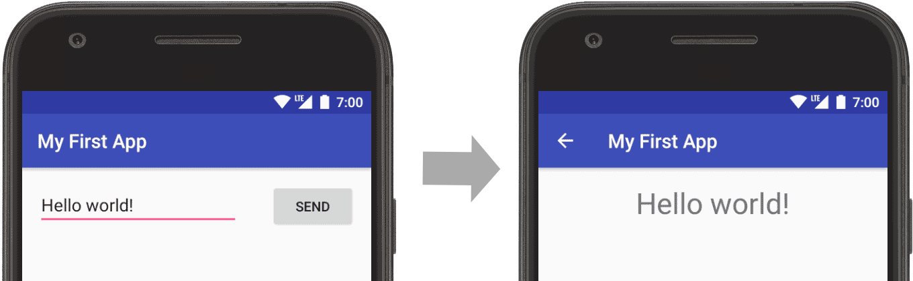

# 启动另一个Activity

> 编写:[crazypudding](https://github.com/crazypudding) - 原文:<http://developer.android.com/training/basics/firstapp/starting-activity.html>

在完成上一课(建立简单的用户界面)后，我们已经拥有了显示一个 activity（一个界面）的app（应用），该 activity 包含了一个文本字段和一个按钮。在这节课中，你将添加一些新的代码到`MyActivity`中，当用户点击发送(Send)按钮时启动一个新的activity。

> 注意：本课程内容期待的运行环境为 Android Studio 2.3及以上

## 响应Send(发送)按钮

按以下步骤在`MainActivity.java`文件中新增一个方法，该方法会在我们点击 Send 按钮时触发：

1.打开文件 `app/java/com.example.myfirstapp/MainActivity.java`，在其中添加一个 `sendMessage()` 方法存根（Method Stub）：

```java
public class MainActivity extends AppCompatActivity {
    @Override
    protected void onCreate(Bundle savedInstanceState) {
        super.onCreate(savedInstanceState);
        setContentView(R.layout.activity_main);
    }

    /** 当用户点击 Send 按钮时调用该方法 */
    public void sendMessage(View view) {
        // 此处的代码会在点击 Send 按钮时执行
    }
}
```

这里可能会出现名为 "Cannot resolve symbol" 的报错，在方法参数 View 下面会出现一条红色的波浪线，这是因为 Android Studio 不能解析 `View` 类。将光标移动到 View 上，然后按下 Alt + Enter （Mac中为 Option + Return）组合键快速修复。（如果出现菜单，则选择 Import class）

2.现在回到 `activity_main.xml` 文件，完成对 sendMessage() 方法的调用：
    
    1.在布局编辑器中选中 Buton 对象
    
    2.在 **Property** 面板中找到 *onClick* 属性，在下拉列表中选中 **sendMessage [MainActivity]** 

完成这些操作后，当点击 Send 按钮时，系统会调用 sendMessage() 方法。

为保证系统能将 sendMessage() 方法与 [android:onclick] 成功匹配，这个方法需要满足以下要求：

* 方法的访问修饰符为 public
* 无返回值
* 只有一个 [View] 类型的参数（代表被点击的 View 对象）

接下来，你可以在这个方法中编写读取文本内容，并将该内容传到另一个Activity的代码。

## 构建一个Intent

[Intent] 是一个可以为不同组件在运行时提供链接的对象，例如为两个 Activity 提供链接。 [Intent] 代表一个 app “想要做某事的意向”，你可以使用它来完成各种各样的任务，不过在本节课程中，我们只使用 intent 来启动另一个 Activity。

在 `MainActivity.java` 文件中，添加一个 EXTRA_MESSAGE 常量并完善 sendMesage() 方法中的代码，如下所示：

```java
public class MainActivity extends AppCompatActivity {
    public static final String EXTRA_MESSAGE = "com.example.myfirstapp.MESSAGE";
    @Override
    protected void onCreate(Bundle savedInstanceState) {
        super.onCreate(savedInstanceState);
        setContentView(R.layout.activity_main);
    }

    /** 当用户点击 Send 按钮时调用该方法 */
    public void sendMessage(View view) {
        Intent intent = new Intent(this, DisplayMessageActivity.class);
        EditText editText = (EditText) findViewById(R.id.editText);
        String message = editText.getText().toString();
        intent.putExtra(EXTRA_MESSAGE, message);
        startActivity(intent);
    }
}
```

Android Studio 可能会再次出现 "Cannot resolve symbol" 的错误，同样使用 Alt + Enter （Mac中为 Option + Return）组合键快速导入类，完成后该类的导入项如下所示：

```java
import android.content.Intent;
import android.support.v7.app.AppCompatActivity;
import android.os.Bundle;
import android.view.View;
import android.widget.EditText;
```

不过对 `DisplayMessageActivity` 的引用仍然会报错，因为这个类还不存在；暂时先忽略这个错误，我们很快就会解决这个问题。

以下是 sendMessage() 方法中要注意的几个地方：

1. Intent 构造方法中有两个参数：

* 第一个参数是 [Context] (之所以用`this`是因为 [Activity] 类是`Context`的子类)

* 接受系统发送 [Intent] 的应用组件对应的 [Class]（在这个案例中，指将要被启动的activity）

2. [putExtra()] 方法将从 EditText 中取到的值附加到 Intent 上。 Intent 可以以键-值对的方式携带数据，这些数据称为 *extras*。此处的键是一个 public 修饰的常量——EXTRA_MESSAGE，因为在另一个 Activity 中，我们需要以这个键来获取它对应的值。以应用包名为前缀来定义 intent extras 的键是一个很好的习惯，这使得 app 在与其他 app 交互的过程中能保证这个键的唯一性。

3. [startActivity()] 方法启动了 [Intent] 定义的 `DisplayMessageActivity` 的实例。现在我们需要新建一个 `DisplayMessageActivity` 类。

## 创建第二个Activity

1.在 **Project** 面板中，右击 **app** 文件夹，依次选择 `New > Activity > Empty Activity`。

2.在弹出的 **Configure Activity** 面板中，将 *Activity Name* 的值修改为 "DispalyMessageActivity" ，其他属性保持默认然后点击 **finsh**。

在这个过程中，Android Studio 自动完成了一下三件事：

* 创建了一个名为 `DisplayMessageActivity.java` 的文件。
* 创建一个相应的布局文件 `activity_display_message.xml`。
* 在 `AndroidManifest.xml` 文件中为该文件添加了对应的 [\<activity>] 标签（没有这个标签将不能启动相应的 Activity）。

如果现在运行 app 并点击第一个 Activity 中的 Send 按钮，app 会跳转到第二个 Activity（也就是刚新建的 DisplayMessageActivity）但是显示一片空白。这是因为新建的 Activity 默认使用模板提供的空白布局页（activity_display_message）。

## 新增一个 TextView

由于新建的 Activity 引用了一个空白的布局页，所以我们现在在这个布局页中添加一个 TextView 用来显示信息。

1.打开文件 `app/res/layout/activity_display_message.xml`。

2.打开自动连接功能，点击工具栏中的 **Turn On Autoconnect** ![layout-editor-autoconnect-on][figure_layout-editor-autoconnect-on]按钮。

3.在 **Pallete** 面板中选中 TextView ，将它拖到布局中靠近父布局顶部并且大约水平居中的位置，当在布局中央会出现一条虚线时放下。这步操作后，ConstraintLayout 的自动连接功能(Autoconnect)为 TextView 新增了相应的约束使其水平居中。

4.为 TextView 的顶部和父布局顶部新增一个约束，这时效果图如图1。

![constraint-textview_2x][figure_constraint-textview_2x]

**图 1.** TextView 在布局中水平居中

当然，也可以为 TextView 做一些样式调整。在 **Properties** 面板中展开 **TextAppearance** 选项改变其中一些属性的值，比如 *textSize* 和 *textColor*。

## 显示消息

现在我们来修改第二个 Activity，修改完成便可以接收第一个 Activity 发来的消息。

1.在 `DisplayMessageActivity.java` 文件中，往 `onCreate()` 方法添加一下代码：

```java
@Override
protected void onCreate(Bundle savedInstanceState) {
    super.onCreate(savedInstanceState);
    setContentView(R.layout.activity_display_message);
    
    // 获取启动此 Activity 的 Intent 并从中取得附带的消息
    Intent intent = getIntent();
    String message = intent.getStringExtra(MainActivity.EXTRA_MESSAGE);

    // 获取布局中 TextView 并为其设置文本信息
    TextView textView = (TextView) findViewById(R.id.textView);
    textView.setText(message);
}
```

2.利用组合键 Alt + Enter（Mac中为 Option + Return）导入需要的类。完成后该类的导入项如下：

```java
import android.content.Intent;
import android.support.v7.app.AppCompatActivity;
import android.os.Bundle;
import android.view.ViewGroup;
import android.widget.TextView;
```

## 添加向上导航（Up Navigation）

我们应该为 app 中所有不是主要入口的页面添加导航，这样一来用户便可以通过 [app bar] 中的 Up 按钮返回到当前页面的逻辑父页面。

我们所需要做的就是在 [AndroidManifest.xml] 文件中为声明哪一个 Activity 是它的逻辑父项。打开清单文件，`app/Manifest/AndroidManifest.xml` ,在名为 DisplayMessageActivity 的 <activity> 标签中新增一下内容：
    
```XML
<activity android:name=".DisplayMessageActivity"
          android:parentActivityName=".MainActivity" >
    <!-- meta-data 标签是为了兼容 API 15 及以下的设备 -->
    <meta-data
        android:name="android.support.PARENT_ACTIVITY"
        android:value=".MainActivity" />
</activity>
```

现在 Android 系统已经自动在 DisplayMessageActivity 的 app bar 中添加了 Up 按钮。

## 运行 app

现在点击工具栏中的 **Apply Changes** 按钮再次运行 app。运行成功之后，试着在 EditText 中输入文字信息如：“Hello world!”并点击 Send 按钮，你会看到信息已经显示在第二个 Activity 中了。如图：



到此为止，已经创建好我们的第一个Android应用了！想要继续学习 Android 应用开发的基础知识，通过下面的链接进入到[下一课]吧。


[android:onClick]: //developer.android.com/reference/android/view/View.html#attr_android:onClick
[View]: //developer.android.com/reference/android/view/View.html
[Intent]: //developer.android.com/reference/android/content/Intent.html
[Context]: //developer.android.com/reference/android/content/Context.html
[Activity]:  //developer.android.com/reference/android/app/Activity.html
[Class]:  //developer.android.com/reference/java/lang/Class.html
[putExtra()]:  //developer.android.com/reference/android/content/Intent.html
[startActivity()]:  //developer.android.com/reference/android/app/Activity.html#startActivity(android.content.Intent)
[\<activity>]:  //developer.android.com/guide/topics/manifest/activity-element.html
[app bar]: //developer.android.com/training/appbar/index.html
[下一课]:  ../supporting-devices/index.html
[figure_layout-editor-autoconnect-on]:  ./layout-editor-autoconnect-on.png
[figure_constraint-textview_2x]:        ./constraint-textview_2x.png
