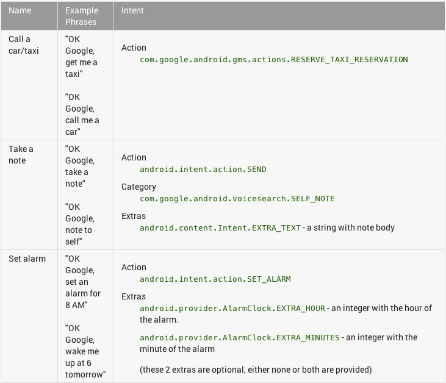

# 添加语音能力

> 编写: [kesenhoo](https://github.com/kesenhoo) - 原文: <http://developer.android.com/training/wearables/apps/voice.html>

语音指令是可穿戴体验的一个重要的部分。这使得用户可以释放双手，快速发出指令。穿戴提供了2种类型的语音操作：

* **系统提供的**

  这些语音指令都是基于任务的，并且内置在Wear的平台内。你在activity中过滤你想要接收的指令。例如包含"Take a note" 或者 "Set an alarm"的指令。

* **应用提供的**

  这些语音指令都是基于应用的，你需要像声明一个Launcher Icon一样定义这些指令。用户通过说"Start XXX"来使用那些语音指令，然后会启动你指定启动的activity。

## 声明系统提供的语音指令

Android Wear平台基于用户的操作提供了一些语音指令，例如"Take a note" 或者 "Set an alarm"。用户发出想要做的操作指令，让系统寻找应该启动最合适的activity。

当用户说出语音指令时，你的应用能够被过滤出来启动一个activity。如果你想要启动一个service在后台执行任务，需要显示一个activity呈现作为线索。当你想要废弃这个可见的线索时，需要确保执行了finish()。

例如，对于"Take a note"的指令，定义一个MyNoteActivity来接收这个指令:

```java
<activity android:name="MyNoteActivity">
      <intent-filter>
          <action android:name="android.intent.action.SEND" />
          <category android:name="com.google.android.voicesearch.SELF_NOTE" />
      </intent-filter>
  </activity>
```

下面列出了Wear平台支持的语音指令：




关于注册intent与获取intent extra的信息，请参考[Common intents](http://developer.android.com/guide/components/intents-common.html).

## 声明应用提供的语音指令

如果系统提供的语音指令无法满足你的需求，你可以使用"Start MyActivityName"的指令来直接启动你的应用。

注册一个"Start"指令和注册手持应用上得Launcher是一样的。

在"Start"指令的后面需要指定的文字, 这个文字需要注册在activity的label属性上。例如，下面的设置能够识别"Start MyRunningApp"的语音指令并启动StartRunActivity.

```xml
<application>
  <activity android:name="StartRunActivity" android:label="MyRunningApp">
      <intent-filter>
          <action android:name="android.intent.action.MAIN" />
          <category android:name="android.intent.category.LAUNCHER" />
      </intent-filter>
  </activity>
</application>
```

## 获取输入的自由语音

除了使用语音指令来启动activity之外，你也可以执行系统内置的语言识别activity来获取用户的语音输入。这对于获取用户的输入信息非常有帮助，例如执行搜索或者发送一个消息。

在你的应用中，startActivityForResult()使用`ACTION_RECOGNIZE_SPEECH`启动系统语音识别应用。在onActivityResult()中处理返回的结果：

```java
private static final int SPEECH_REQUEST_CODE = 0;

// Create an intent that can start the Speech Recognizer activity
private void displaySpeechRecognizer() {
    Intent intent = new Intent(RecognizerIntent.ACTION_RECOGNIZE_SPEECH);
    intent.putExtra(RecognizerIntent.EXTRA_LANGUAGE_MODEL,
            RecognizerIntent.LANGUAGE_MODEL_FREE_FORM);
// Start the activity, the intent will be populated with the speech text
    startActivityForResult(intent, SPEECH_REQUEST_CODE);
}

// This callback is invoked when the Speech Recognizer returns.
// This is where you process the intent and extract the speech text from the intent.
@Override
protected void onActivityResult(int requestCode, int resultCode,
        Intent data) {
    if (requestCode == SPEECH_REQUEST && resultCode == RESULT_OK) {
        List<String> results = data.getStringArrayListExtra(
                RecognizerIntent.EXTRA_RESULTS);
        String spokenText = results.get(0);
        // Do something with spokenText
    }
    super.onActivityResult(requestCode, resultCode, data);
}
```
